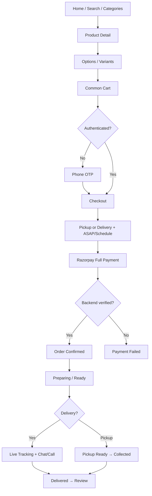

# GUNUCO Customer App — User Flows (Final)

> Final flows from `GUNUCO_PRODUCT_DECISIONS.md`. Custom-cake / advance-payment flows are **excluded**.

---

## 1. Authentication

```text
Enter Phone Number
  → Send OTP (SMS)
  → Enter OTP
  → Verify OTP
  → Login / Register (Customers entity)
  → Store access + refresh tokens (SecureStore)
  → Customer App (tabs) or resume interrupted checkout
```

### Change phone

```text
Profile → Change Phone
  → Enter new phone
  → OTP on new number
  → Verify → Updated
```

### Session

```text
Cold start → restore tokens → refresh if needed → Tabs
Logout / refresh fail → clear secure storage → Phone Auth
```

Remain logged in until logout; multiple devices supported.

---

## 2. Guest Shopping → Auth at Checkout

```text
Open App (guest)
  → Browse Home / Search / Categories / Product Details
  → Select options / quantity (guest allowed)
  → Add to Cart
       → Sign in required (server-persisted cart; no local guest cart)
       → Phone → OTP → Login/Register
  → Cart → Proceed to Checkout
  → If guest: Phone OTP (`returnTo` = `/checkout`) → Checkout
  → If authenticated: Checkout
  → Revalidate → POST /checkout → Payment (Phase 9)
```

Guest checkout is **not** allowed. Guest local draft cart / `cart/merge` remains **[CONFIRM]** and is not implemented.

---

## 3. Shopping (Authenticated or after login)

```text
Home
  → Main Category (Cakes)
  → Subcategory (GUNUCO Premium | Cakes | Cookies | Wedding Cakes | Birthday Cakes)
  → Product Catalogue
  → Product Details (`/product/[id]`)
  → Select available options/variants (schema-driven; same UI for all categories)
  → Select quantity
  → Add to Cart (`POST cart/items` when signed in)
  → Common Cart (`/(tabs)/cart`)
  → Checkout (`/checkout`)
```

Same path via Search or Offers. Wedding Cakes and Birthday Cakes use this catalogue flow — no custom-cake quotation.

---

## 4. Cart

```text
Cart tab (`/(tabs)/cart`)
  → Guest: Sign in (phone OTP). No local cart.
  → Authenticated: GET /cart
  → View mixed catalogue items (one common cart)
  → Update quantity (PATCH /cart/items/{id}) / remove (DELETE)
  → Invalid options → Product Details (existing option renderer)
  → Apply / remove coupon (optional)
  → Proceed to Checkout
       → Guest: Phone OTP, then `/checkout`
       → Authenticated: `/checkout`
       → Checkout calls POST /cart/revalidate then POST /checkout
```

One cart → one checkout → one order (multi-item allowed; backend validates joint fulfilment).

---

## 5. Fulfilment

```text
Cart → Proceed to Checkout
  → Auth gate if guest (Phone OTP → return to /checkout)
  → Load GET /cart (empty → Continue shopping)
  → Choose Pickup OR Delivery
  → Delivery: select/confirm address (default if marked) → POST /fulfilment/serviceability { lat, lng }
       → serviceable + fee (paise) or not serviceable
  → Pickup: GET /fulfilment/pickup-info (no production-house picker)
  → ASAP (only if backend asapAvailable) OR Schedule for Later
  → GET /fulfilment/slots?date&fulfilmentType (never hard-coded)
  → If same-day unavailable → backend cutoff message; pick another backend date
  → Review coupon / store credit / tax / delivery fee / total (backend values)
  → Continue to Payment
       → POST /cart/revalidate
       → if invalid: show changes, stay Checkout
       → if valid: POST /checkout (idempotency UUID reused on retry)
       → navigate to /payment with checkout id
       → Razorpay + backend verify is Phase 9 (Payment screen)
```

Production house is **backend-assigned**; customer does not pick it. Google Maps used for address pin/validation.

---

## 6. Payment (Razorpay — Phase 9 implemented)

```text
POST /checkout success
  → set in-memory payment session (amount paise, fulfilment labels, optional Razorpay order/key)
  → /payment?checkoutId=
  → Pay Now
  → If checkout already returned razorpayOrderId + amount: reuse it
  → Else POST /payments/razorpay/initiate { checkoutId, idempotencyKey }
  → Open react-native-razorpay (hosted UPI / card / net banking UI)
  → Razorpay success is an attempt only
  → POST /payments/razorpay/confirm (signature forwarded; backend verifies)
  → Backend verified → Order Confirmation + invalidate Cart + GET /cart
  → Razorpay fail → Payment failed + Try Again (no new checkout)
  → User closes Razorpay → Payment cancelled
  → Network/uncertain after pay → UNKNOWN (retry confirm only; no status GET)
```

No advance/balance split for catalogue orders. Do not confirm order from client-only Razorpay success.

Public Razorpay key: `EXPO_PUBLIC_RAZORPAY_KEY_ID`. Razorpay secret stays on the backend. Native development/production build required (not Expo Go).

---

## 7. Orders + Tracking (Phase 10 implemented)

```text
Profile → Orders
  ├── Active
  ├── Past
  └── Cancelled

Order Confirmation → View Order (orderId only) → GET /orders/{id}

Order Detail
  ├── Timeline (backend history)
  ├── Track (if trackingAvailable)
  ├── Rider Chat / Call (if backend flags)
  ├── Cancel (if cancellation-eligibility.allowed)
  ├── Invoice (if invoiceAvailable → PDF URL)
  ├── Reorder (if canReorder) → Cart, never Checkout
  ├── Write Review (GET reviewable-items + Phase 6 write flow)
  └── Complaint/Return (if complaintAllowed)
```

Pickup path omits rider tracking/chat unless the backend still sets those flags.

---

## 8. Reorder

```text
Past Orders → Reorder
  → POST /orders/{id}/reorder
  → Backend revalidates availability / price / options / offers
  → GET /cart
  → Customer reviews Cart (CartChangeBanner)
  → Checkout only if the customer continues
```

---

## 9. Cancellation

```text
Active Order → Cancel
  → GET /orders/{id}/cancellation-eligibility
  → If allowed: pick predefined reason (+ Other text) → confirm with backend refund amount if provided
  → POST /orders/{id}/cancel (same idempotency key on retry)
  → Invalidate order list/detail
  → If not allowed: “Cancellation is no longer available.”
```

Frontend does not calculate 0–30 / 30–60 minute refund percentages.

---

## 10. Wishlist

```text
Product / listing heart
  → Guest: Phone OTP, then pending add + return to product when possible
  → Authenticated: POST /wishlist/{productId} or DELETE
Profile → Wishlist (`/wishlist`)
  → Open product / Remove heart
  → Add to cart:
       if required options are unknown or required → Product Details
       if no required options (known) → POST /cart/items (quantity 1, existing options payload)
```

Server-persisted wishlist for signed-in customers. No local guest wishlist.

---

## 11. Ratings & Reviews

```text
Product Detail → Reviews (`/product/{id}/reviews`)
  → Approved review list (paginated)

Eligible order item (future Past Order)
  → Write Review (`/review/write?orderItemId=`)
  → Stars + text
  → POST /reviews (backend eligibility + moderation)
```

Write Review is not shown on every product. Orders UI is not part of this phase; the form is ready for a real `orderItemId`.

---

## 12. Offers & Coupons

```text
Home Offers / Offer Detail → shop products
Cart / Checkout → enter coupon code → Apply
  → Backend validates + stacking rules
  → Updated totals
```

---

## 13. Store Credit

```text
Profile → Store Credit (balance + history)
Checkout → Use Store Credit (`POST /cart/apply-store-credit` `{ max: true }` **[CONFIRM]**)
  → Backend ledger applies credit
  → Remove via `DELETE /cart/store-credit`
  → Residual payable is Phase 9 Razorpay
```

---

## 14. Support

```text
Order / Support Hub → Create Ticket (+ ≤3 photos if needed)
  → Support replies
  → Customer replies
  → Support resolution
```

---

## 15. Notifications

```text
Push received → tap deep link → Order Detail / Live Tracking / Ticket / Review
In-app Notifications Center → same
```

Permission asked contextually (e.g. after explaining order updates).

---

## 16. Invoice

```text
Order Detail → Download Invoice
  → Backend PDF URL → open/share
```

---

## 17. Theme

```text
Settings → Light / Dark (and system if offered)
  → Design-system theme tokens switch app-wide
```

---

## 18. Force Update / Maintenance

```text
Bootstrap → fetch app config
  → Force update → blocking Update screen
  → Maintenance → blocking Maintenance screen
  → Else continue
```

---

## Core Commerce Diagram



---

*End of user flows.*
