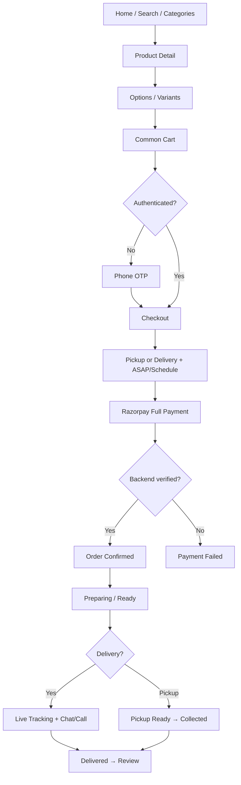

# GUNUCO Customer App — User Flows (Final)

> Final flows from `GUNUCO_PRODUCT_DECISIONS.md`. Custom-cake / advance-payment flows are **excluded**.

---

## 1. Authentication

```text
Enter Phone Number
  → Send OTP (SMS)
  → Enter OTP
  → Verify OTP
  → Login / Register (Customers entity)
  → Store access + refresh tokens (SecureStore)
  → Customer App (tabs) or resume interrupted checkout
```

### Change phone

```text
Profile → Change Phone
  → Enter new phone
  → OTP on new number
  → Verify → Updated
```

### Session

```text
Cold start → restore tokens → refresh if needed → Tabs
Logout / refresh fail → clear secure storage → Phone Auth
```

Remain logged in until logout; multiple devices supported.

---

## 2. Guest Shopping → Auth at Checkout

```text
Open App (guest)
  → Browse Home / Search / Categories / Product
  → Select options → Add to Cart (local draft until login — sync rules backend-defined)
  → Cart → Checkout
  → Authentication Required
  → Phone → OTP → Login/Register
  → Resume Checkout → Payment → Order
```

Guest checkout is **not** allowed.

---

## 3. Shopping (Authenticated or after login)

```text
Home
  → Main Category (Cakes)
  → Subcategory (GUNUCO Premium | Cakes | Cookies | Wedding Cakes | Birthday Cakes)
  → Product Catalogue
  → Product Details
  → Select available options/variants (schema-driven)
  → Add to Cart
  → Common Cart
  → Checkout
```

Same path via Search or Offers.

---

## 4. Cart

```text
Cart
  → View mixed catalogue items
  → Update quantity / remove / edit options
  → Apply coupon (optional)
  → Proceed to Checkout
  → Backend revalidates:
        availability, price, quantity, options, offers, fulfilment
  → If changed → "Cart Updated" review UI
  → If OK → Checkout
```

One cart → one checkout → one order (multi-item allowed; backend validates joint fulfilment).

---

## 5. Fulfilment

```text
Checkout
  → Select / confirm Address (Delivery) OR show Pickup info
  → Choose Pickup OR Delivery
  → Choose ASAP OR Schedule for Later
  → Backend-provided slots (never hard-coded)
  → If same-day unavailable → show cutoff message; pick another date
  → Review fees / tax / discounts / store credit
  → Continue to Payment
```

Production house is **backend-assigned**; customer does not pick it. Google Maps used for address pin/validation.

---

## 6. Payment (Razorpay — Full Payment)

```text
Checkout
  → Place Order / Pay
  → Initiate Razorpay (amount in paise)
  → Customer pays via UPI / Card / Net Banking
  → Gateway return → Payment Processing
  → Backend payment verification
  → Success → Order Confirmed
  → Failure → Payment Failed (retry / support)
```

No advance/balance split for catalogue orders. Do not confirm order from client-only Razorpay success.

---

## 7. Delivery Tracking

```text
Order Confirmed
  → Preparing
  → Ready
  → Out for Delivery
  → Live Tracking (map, rider location, ETA)
  → Rider Chat / Call (when backend allows)
  → Delivered
  → Review eligible products
```

Pickup path omits rider tracking/chat; shows pickup readiness instead.

---

## 8. Reorder

```text
Past Orders → Order Detail → Reorder
  → Backend revalidates availability / price / options / offers
  → Items added to Cart (with change notices if needed)
  → Customer reviews Cart → Checkout
```

---

## 9. Cancellation

```text
Active Order → Cancel
  → Backend eligibility by status
  → If allowed: pick predefined reason (+ Other text)
  → Confirm → Cancelled tab / refunds per policy
  → If not allowed: show ORDER_CANCELLATION_NOT_ALLOWED message → Support
```

---

## 10. Wishlist

```text
Product → Wishlist heart
  → Profile → Wishlist
  → Open product / Add to cart / Remove
```

Requires authenticated customer for server wishlist **[guest wishlist local until login — CONFIRM]**.

---

## 11. Ratings & Reviews

```text
Delivered / Past Order → Write Review (eligible items)
  → Stars + text
  → Submit (backend eligibility + moderation)
Product Detail → read Review list
```

---

## 12. Offers & Coupons

```text
Home Offers / Offer Detail → shop products
Cart / Checkout → enter coupon code → Apply
  → Backend validates + stacking rules
  → Updated totals
```

---

## 13. Store Credit

```text
Profile → Store Credit (balance + history)
Checkout → Use Store Credit (if allowed)
  → Backend ledger applies amount
  → Pay remaining via Razorpay if needed
```

---

## 14. Support

```text
Order / Support Hub → Create Ticket (+ ≤3 photos if needed)
  → Support replies
  → Customer replies
  → Support resolution
```

---

## 15. Notifications

```text
Push received → tap deep link → Order Detail / Live Tracking / Ticket / Review
In-app Notifications Center → same
```

Permission asked contextually (e.g. after explaining order updates).

---

## 16. Invoice

```text
Order Detail → Download Invoice
  → Backend PDF URL → open/share
```

---

## 17. Theme

```text
Settings → Light / Dark (and system if offered)
  → Design-system theme tokens switch app-wide
```

---

## 18. Force Update / Maintenance

```text
Bootstrap → fetch app config
  → Force update → blocking Update screen
  → Maintenance → blocking Maintenance screen
  → Else continue
```

---

## Core Commerce Diagram



---

*End of user flows.*
